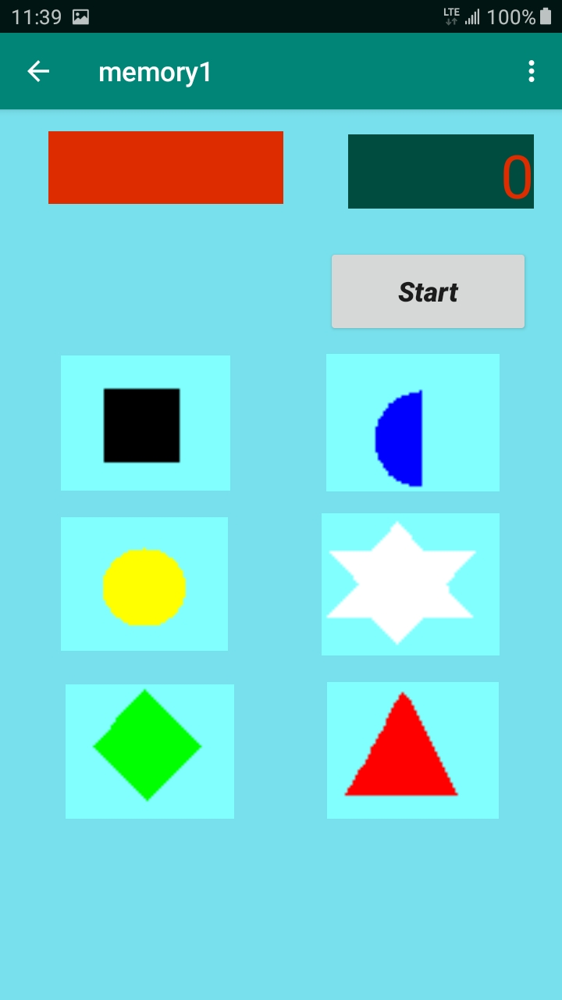
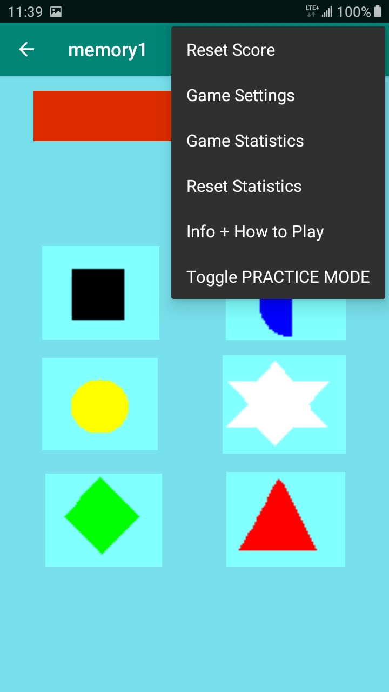

This is an Android based visual and auditory and reflex challenge game. Object is to tap out a replay of randomly displayed symbols - each with their own unique auditory tone - as quickly as possible.  &#128512; 

The Game Opening screen:

{: width="75%" height="75%"}  
Game start.   Work in progress, more memory1 samples to come... 

The Game Menu screen:

{: width="75%" height="75%"}  
Game menu.   Work in progress, more memory1 samples to come... 

[Back to screen shots](https://bobkoto.github.io/bob-site/image02)

# Tech Notes: 
A casual memory and reflex challenge game for Android created with Java using Android SDK.

Gameplay uses player screen taps to replicate a random sequence of 6 symbols and their associated auditory tones, randomly produced by the game, with scoring depending on how fast the player can repeat the random sequence.

I play tested this on a mid-range Android phones- Galaxy J7 - and phones as old as Galaxy S4,
often playing for an hour or more with little drain on the battery. 

This project is not yet available on Github.