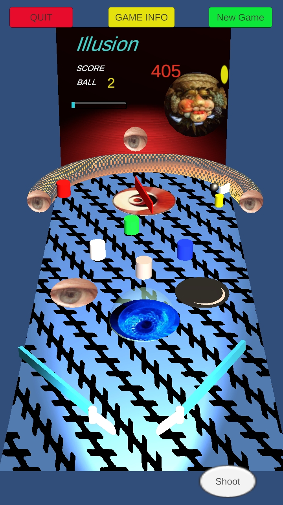
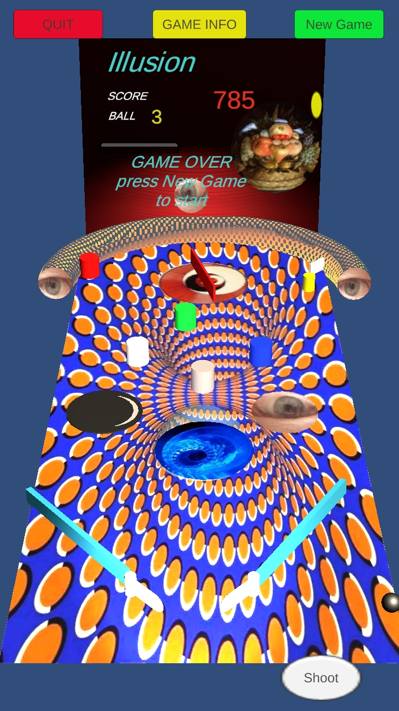

I created this simple, easy to play, Android based pinball in Unity and C#.

Gameplay is physics based. To make it a bit interesting I included auditory (best with ear phones) and optical illusions.

[Back to screen shots](https://bobkoto.github.io/bob-site/image02)

On ball in play 2, the game surface looks like this:

{: width="75%" height="75%"}
"Ball 2 playing surface and yes there is an illusion..."

On ball in play 3, the game surface looks like this:

{: width="75%" height="75%"}
"Ball 3 playing surface and yes there is more obviously an illusion..."

[Back to screen shots](https://bobkoto.github.io/bob-site/image02)

Find the pinball project at [Pinball project](https://github.com/bobkoto/touchinput1/) aka touchinput1