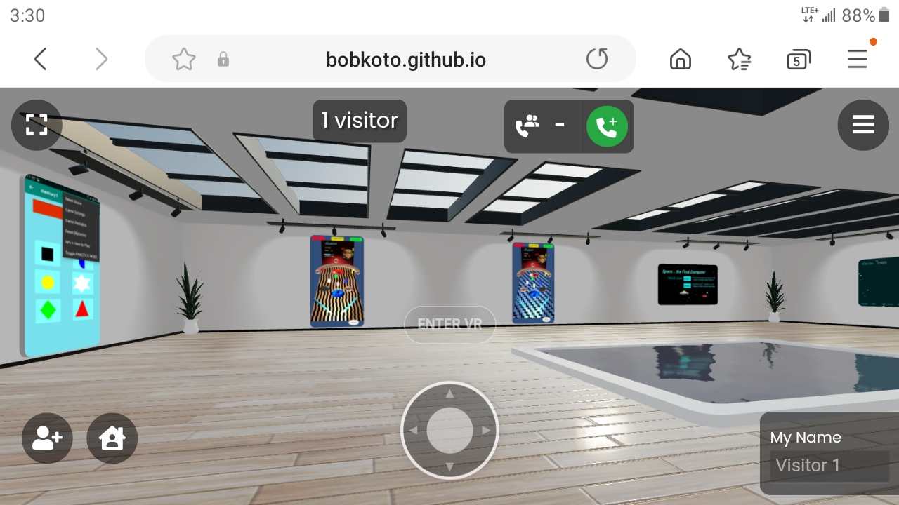

 

    

 
<!-- {: width="75%" height="75%"}    -->
Go to the [Showcase](https://bobkoto.github.io/bob-site/webshowcase) and cruise around a little metaverse (courtesy of Croquet.io) set up for and by this site. Maybe you'll find me or someone else - in there. Note: started 1/24, will change a lot at first. You might find some quick videos and games to play in your browser. 

### The best part of web showcase can be just moving around the 3D webshowcase-land.
...and see some opportunities. Another nice part is it works with mobiles and desktops, like everybody else's. Right?

# About this showcase kinda prototype (expect to change often): So far we have:

- images of games 
- a video  
- **links to WebGL games playable in your browser** 
- a PDF file with some info you can page thru

Just basic "stuff"

# Props to the people at Croquet.io for WebShowcase, &#128512;  

  
Before or after you go get a quick inspiration/pick me up from the lucky kongas...

<a href="{{ site.baseurl }}/mediapages/audiopages/kongasplaypage"><i><strong>Play the Kongas!</strong></i></a>

