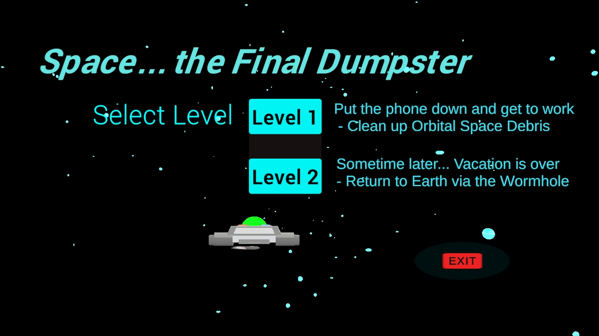
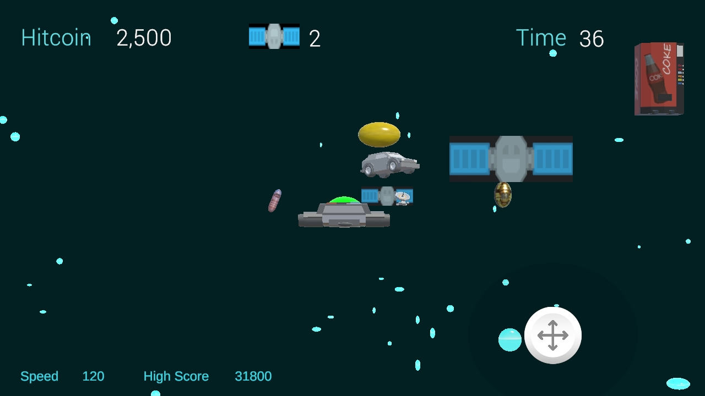
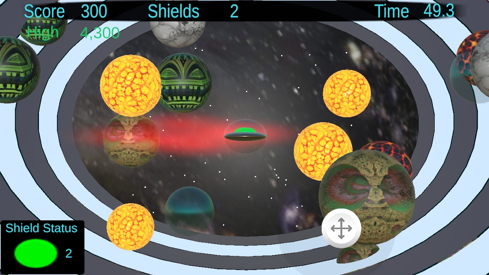

This is an Android based 3D arcade game with 2 levels that run for just 60 seconds. &#128512; 

Gameplay uses a mobile on-screen joystick to move your spaceship and intercept or evade objects. 
Player can set their preferred joystick position - left, center, or right.
Level 1 has 3 player selectable speed setttings.  

[Back to screen shots](https://bobkoto.github.io/bob-site/image02)

The Game Opening screen:

{: width="75%" height="75%"}  
Game start, level select.

The Space Junk level 1:

{: width="75%" height="75%"}  
Level 1, space junk, gameplay. If we can send a Tesla to space why not soda machines too. &#128512; 

The Space Junk level 1 game speed setup:

{: width="75%" height="75%"}  
Level 1 has 3 speeds to choose from. The default is slowest.

The Wormhole level 2:

{: width="75%" height="75%"}  
Level 2, wormhole, game play. The red streak is a menace that got vaporized by our shielded ship.

[Back to screen shots](https://bobkoto.github.io/bob-site/image02)

# Tech Notes: 
3D casual arcade game for Android created in Unity and C#.

A variation of endless runner (on Z axis)

I play tested this on a mid-range Android phones- Galaxy J7 - and phones as old as Galaxy S4,
often playing for an hour or more with little drain on the battery. 

Find this project at [Spacergy project](https://github.com/bobkoto/spacergy/) 